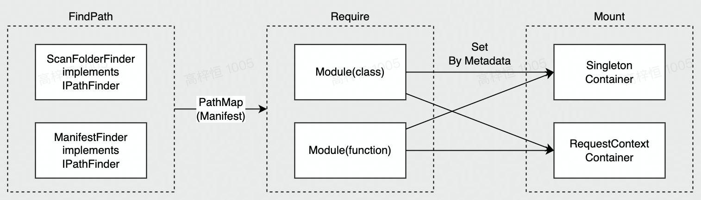
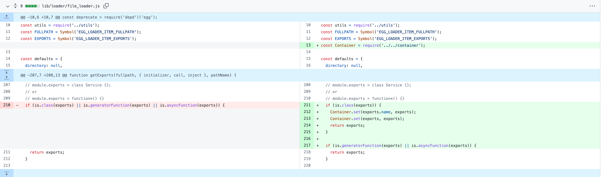
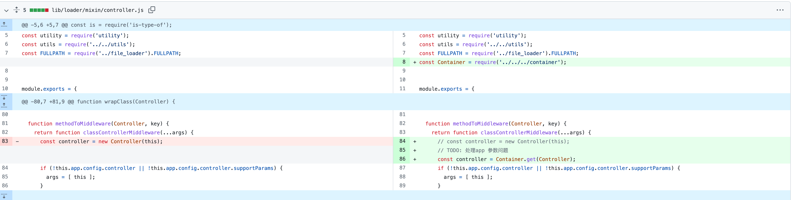
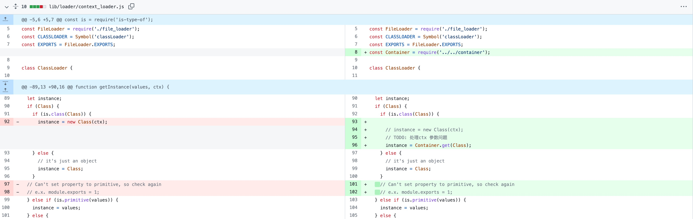

# 加载机制 Loader



> 从概念上看，Loader 更加侧重的是以编程约束规范来提升项目协作一致性体验，因此整体设计上不与请求模型中的 Context/Trigger/Middleware 做过深耦合。

Core 内置 Loader 实现，主要的环节包括：

- FindPath 扫描目录/读取 **Manifest**
- Require 加载模块并 attach 对应的 **Meta**
- Mount 将对象池交付并按照其上的 **Meta** 挂载到 Context/Application or IOC Contianer

其中，Manifest 用于描述目录、Path、MetaHandler 的关系，格式如下：

## 目录扫描/读取 Manifest

Core 中内置默认的目录扫描规范，优先级 CustomLoader -> Manifest -> 目录。

### 基于目录

- 以下路径属于内置于 Core 的加载部分
  - config: `${rootDir}/config/config.${env}.ts`
  - plugin: `${rootDir}/config/plugin.${env}.ts`
  - extend:
    - `${rootDir}/app/extend/application.ts`
    - `${rootDir}/app/extend/context.ts`
    - `${rootDir}/app/extend/request.ts`
    - `${rootDir}/app/extend/helper.ts`
- 上层框架的协议实现可以补充加载路径，如：
  - service: `${rootDir}/service/${name}.ts`
  - controller: `${rootDir}/controller/${name}.ts`
  - router: `${rootDir}/router/${name}.ts`

### 基于Manifest

`mainfest.json` 文件提供扁平化的文件路径，提供给 loader 加载。

以 HTTP 框架中的常见 Case 为例：

```json
{
  "root": "/rootDir",
  "items": [
    {
      "path": "src/app/service/user.ts",
      "type": "service"
    },
    {
      "path": "src/app/controller/user.ts",
      "type": "controller"
    },
    {
      "path": "src/app/middleware/auth.ts",
      "type": "middleware"
    },
    {
      "path": "src/app/extend/helper.ts",
      "type": "extend"
    },
    {
      "path": "src/app/config/config.${env}.ts",
      "type": "config"
    }
  ]
}
```

### CustomLoader

```javascript
export default () => {
  // customLoader
  customLoader: {
      directory: 'app/need_custom_loader',
      inject: 'singleton' | 'execution' | 'transient',
      // 是否加载框架和插件的目录
      loadunit: false,
  }
}
```

## 配置加载 Load Config

对于配置文件 `config.${env}.ts` 的加载，将根据服务的环境变量做如下处理。

- 默认约定配置文件为 `config.default.ts` ，默认环境变量 `ARTUS_SERVER_ENV` ，可以通过 hook 来定制相关的环境变量解析方式。
- 根据环境变量 `env` 来加载对应 `config.${env}.ts` 配置文件
- `config.${env}.ts` 将采用 [deepmerge](https://github.com/TehShrike/deepmerge) 的方式进行合并，值得注意的是对于数组项的合并，框架采用了直接替换的方式，因为数组元素之间往往存在顺序的要求，直接合并可能会导致与预期不符的结果。例如 环境变量为`ARTUS_SERVER_ENV=prod` ，`config.prod.ts` 将会覆盖并合并 `config.default.ts`
- config 支持异步，可通过异步函数来实现更加复杂的配置。由于 Artus 默认采用单进程模型，需要增强远程配置获取的前置能力，以便放置类似的异步配置加载逻辑。常见的异步获取远程配置有密钥管理服务 KMS(Key Management Service), 通过密钥来保护后台应用配置文件。
- 配置加载完毕后，需要 dump 出配置信息用于分析和排查
- [TODO] 可以通过 setConfig API，在 config 加载完成后对 config 进行修改， 以便框架记录配置改动的操作位置，方便分析

```typescript
// 以 ARTUS_SERVER_ENV=prod 为例
// config.default.ts
// 下面的 Config 可以是 Object 或 Async Function
export default {
    configA: 'configA',
    mysql: {
      host: 'localhost',
      port: 3306,
      password: '123456'
    }
}

// config.prod.ts
export default {
    configB: 'configB',
    mysql: {
      host: '10.12.13.14',
      port: 3306,
      password: 'asdfsadfcsadcasdfaasfdaf='
    },
}

// 合并覆盖后的配置
{
    "configA": "configA",
    "configB": "configB",
    "mysql": {
      "host": "10.12.13.14",
      "port": 3306,
      "password": "asdfsadfcsadcasdfaasfdaf="
    },
}
```

```typescript
// config.default.ts
// 支持使用函数及异步方式
export default async (appInfo, appConfig) => {
  return {
    url: appConfig.host + 'xxx',
    asyncData: await Promise.resolve('async_data'),
    // kms 解密配置
    encryptedData: await kmsClient.decrypt('encrypted_text'),
  };
};
```

`ARTUS_SERVER_ENV` 默认值枚举值如下

```typescript
enum ARTUS_SERVER_ENV {
  DEV = 'development',
  PROD = 'production',
  DEFAULT = 'default',
}
```

- `default`: 默认值，即没有环境变量时默认读取的配置文件名 `config.default.ts`
- `development`: 本地开发环境，即 `ARTUS_SERVER_ENV=development` 时，将 `config.development.ts` 和 `config.default.ts` 进行 deepmerge 操作
- `production`: 某种意义上的生产环境，即 `ARTUS_SERVER_ENV=production` 时，将 `config.production.ts` 和 `config.default.ts` 进行 deepmerge 操作

## 模块/文件加载 Load Module / File

通过上一环节的目录扫描与读取，Loader 将能够持有一份标准化的入口文件 Path 列表（统称为 Manifest），Loader 需要针对该部分文件进行加载行为：

- 对于 JS / TS 文件，以模块的形式
  - 其中，模块应包括 Meta 信息用于最终消费环节（如：Scope），有以下形式可用：
    - JS 编程界面中通过预先配置的形式由上层框架指定
    - TS 编程界面使用上层框架实现对应的装饰器，调用 Core 提供的接口使用 Reflect attach 上述信息到 Class
  - 模块的加载应当兼容 CommonJS 和 ECMAScript Module
- 对于 JSON 等元信息文件，利用 Manifest 或 Loader 配置中的解析规则处理

POC 如下：

- 加载流程

```typescript
interface FileItemLoader {
    loadFile() {}
}

class ModuleLoader implements FileItemLoader {
    loadFile (path): Promise<Module> {
        if (isESModule(path)) {
            // 存在异步问题，可能影响 Loader 最终 API
            return import(path);
        }
        return require(path);
    }
}

class MetaFileLoader implements FileItemLoader {
    loadFile (path) {
        if (isJSON(path)) {
            return JSON.parse(fs.readFileSync(path));
        }
        return null;
    }

}
```

- Meta 信息挂载（JS）
  - 按照目录约定的形式，Meta 由上层框架通过对 Loader 的预先配置指定
- Meta 信息挂载（TypeScript Decorator）

```typescript
// app/service/user.ts 用户代码
@Service(ScopeEnum.Application)
class UserService {
  getInfo() {
    return {
      hello: 'world',
    };
  }
}

// decorator.ts 上层框架实现代码/Core 默认配置
export const Service = (scope: ScopeEnum) => (target) => {
  attachReflectMetaData(target, {
    namespace: 'sercice',
    scope,
  });
};
```

## 基于 IoC 的挂载机制

- Artus 中的 Core 实现底层基于 IoC（控制反转，Inversion of Control）实现，便于在上层框架中集成 DI（依赖注入，Dependency Injection）、AOP（面向切面编程，Aspect Oriented Programming）等特性
- 实现原理为：
  - 在 Core 中按照 Scope 提供 IOC Container 作为基础对象池，Scope 包括
    - Singleton（单例生命周期，全局执行一次实例化）
    - Execution（执行生命周期，每次执行时实例化）
    - Transient（临时生命周期，每次使用时实例化）
  - Loader 及上层框架的 Cutsom Loader 应当在挂载环节中将加载的类对象
    - 把 Controller 和 Service 等类的实例化创建过程托管给容器
    - Config 配置内容托管给容器
    - 插件中扩展的属性等也托管给容器，用户能够在 IoC 模式下注入这些扩展的属性
      - 例如 Redis、MySQL Client
    - 希望兼容现有 Egg/Gulu 中 app/ctx 等数据模型的前提下，提供 IoC 的开发模式
      - 对于上层框架，暴露 IoC Container 的操作方法，用于实现 DI/AOP...
      - 对于既有应用迁移，提供 delegate 代理层，模拟传统 app/ctx 用法，代理层的 getter/setter 访问 IoC Container

PoC 如下

- Container 容器伪代码

```javascript
// container.js
class Container {
  constructor() {
    this.registry = new Map();
  }

  get(identifier) {
    const clazz = this.registry.get(identifier);
    const instance = new clazz();
    // TODO: 处理注入的属性
    return instance;
  }

  set(identifier, target) {
    this.registry.set(identifier, target);
  }

  // 装饰器
  inject(identifier) {
    return (target, properName, index) => {};
  }

  // 装饰器
  injectable() {
    return (target) => {
      // identifier 同时注册class 本身和类名两种形式
      this.set(target, target);
      this.set(target.name, target);
    };
  }
}

module.exports = new Container();
```

[lib/loader/file_loader.js](https://github.com/eggjs/egg-core/blob/master/lib/loader/file_loader.js#L210)



[lib/loader/mixin/controller.js](https://github.com/eggjs/egg-core/blob/master/lib/loader/file_loader.js)



[lib/loader/context_loader.js](https://github.com/eggjs/egg-core/blob/master/lib/loader/context_loader.js#L92)



- 以注入形式使用 IoC 托管的类实例（TypeScript）

```typescript
// src/app/controller/home.ts
import { Inject, Injectable } from '@artusjs/a-framework';
import { AnyService } from '../service/user';

@Injectable({
    key: 'anyClassA' // Optionial
    scope: ScopeEnum.Singleton,
    namespace: 'controller'
})
export default class AnyClassA {
    // 以下异步钩子会需要类似 getAsync 的异步函数进行操作
    @Init()
    async onInit() {
        await init();
    }
    @Destroy()
    async onDestroy() {
        await destroy();
    }

    @Inject(AnyService, {
        // Optionial
    })
    anyService: AnyService;

    async anyMethod() {
        return this.anyService.getInfo();
    }
}
```

- 以传统模型使用 IoC 托管的类实例（JavaScript/代理层）
  - 注：如有异步情况（getAsync）这种代理层可能不能完全向下兼容（需要 await）
  - 对于代理层不能完全处理的情况（如：异步）需要在分析（构建时）或启动（运行时）给出 warning 提示

```javascript
// src/app/controller/home.js
export default class AnyClassB {
  async anyMethod() {
    const anyClassA = ctx.service.anyClassA;
    await anyClassA.onInit();
    const result = anyClassA.anyMethod(); // or app.service(scope is application)
    await anyClassA.onDestroy();
    return result;
  }
}
```
