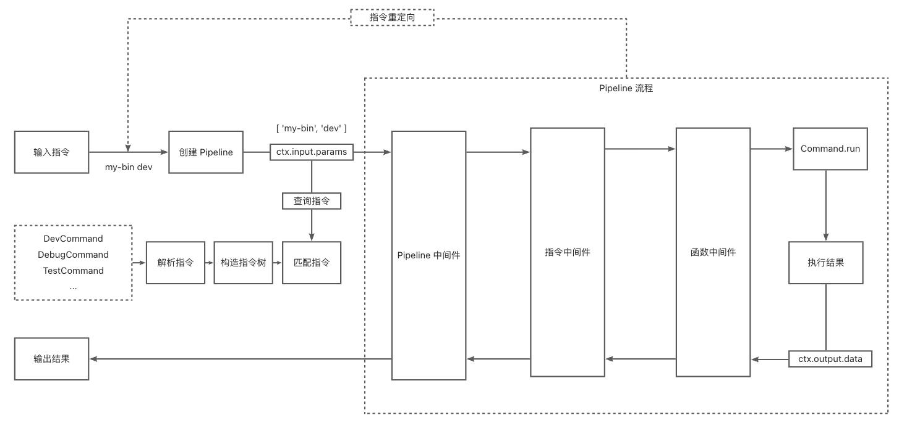

# 命令行工具 CLI

artus 并不限定于具体的应用场景（如 web），故而可以基于该设计理念，适配不同的业务场景。

本教程中，我们将演示如何通过 `@artus-cli/artus-cli`，实现一个简单的 CLI 工具。

## 特性

> https://github.com/artus-cli/artus-cli

基于 Artus 的 pipeline 流水线设计，将指令输入作为协议，将指令执行通过中间件模式串联，支持指令重定向。
用户编程风格方面，采用 IoC 的方式来定义指令、参数配置、中间件。



## 示例

```bash
.
├── node_modules
├── package.json
├── src
│   ├── bin
│   │   └── cli.ts
│   ├── cmd
│   │   └── main.ts
│   └── meta.json
└── tsconfig.json
```

### 配置

**_tsconfig.json_**

```json
{
  "extends": "@artus/tsconfig",
  "compilerOptions": {
    "baseUrl": ".",
    "outDir": "dist",
    "inlineSourceMap": true,
    "resolveJsonModule": true
  }
}
```

**_package.json_**

```json
{
  "name": "@artusx/cmd",
  "version": "1.0.1-dev.1",
  "description": "command line interface for artusx",
  "keywords": ["artus.js"],
  "type": "commonjs",
  "bin": "dist/bin/cli.js",
  "files": ["dist"],
  "scripts": {
    "build": "npm run tsc && npm run build:metadata",
    "build:metadata": "cp meta.json ./dist/meta.json",
    "dev": "ts-node src/bin/cli.ts",
    "tsc": "rm -rf dist && tsc"
  },
  "dependencies": {
    "@artus-cli/artus-cli": "~0.2.10"
  },
  "devDependencies": {
    "@artus/tsconfig": "~1.0.1",
    "@types/node": "~20.11.7",
    "ts-node": "~10.9.2",
    "tslib": "~2.6.2"
  }
}
```

**_meta.json_**

```json
{
  "name": "cmd"
}
```

### 逻辑

**_src/bin/cli.ts_**

```ts
#!/usr/bin/env node

import path from 'path';
import { start } from '@artus-cli/artus-cli';

start({
  baseDir: path.join(path.resolve(__dirname, '..')),
});
```

**_src/cmd/main.ts_**

```ts
import { DefineCommand, Command, Option } from '@artus-cli/artus-cli';

@DefineCommand({
  command: 'gen [type]',
  description: 'my cmd',
})
export class MainCommand extends Command {
  @Option({
    alias: 't',
    default: 'lib',
    description: 'project type',
  })
  type: string;

  async run() {
    console.info('gen project with type: %s', this.type);
  }
}
```

### 运行

```bash
$ ts-node src/bin/cli.ts -h

Usage: @artusx/cmd <cmd>

Available Commands

  help [command]   show help infomation for command
  gen [type]       my cmd

Options

  -h, --help       Show Help
  -v, --version    Show Version
```
