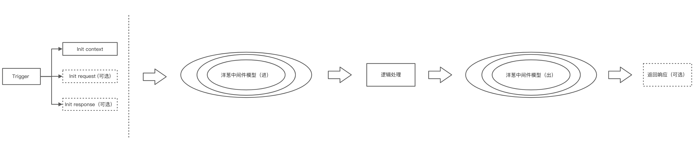

# 请求处理机制 Trigger

Artus 作为底层 Core 规范，具备协议无关特性，请求处理模型基于洋葱模型和 Context 构建，但不具备协议相关的概念。上层框架可基于以下模型，构建出适用于特定协议的实现（如：HTTP/1.1, HTTP/2, QUIC, HTTP/3, WebSocket, Timer, MQ, gRPC, etc...）。

## 交互模型统一

对于可以抽象成 C/S 交互的场景：

- 请求 - 响应模型
- 单独的请求模型（无响应）
- 单独的响应模型（无请求）
- 单次请求 - 多次响应模型

以上交互场景其实可以进一步抽象为：

1. 逻辑触发
2. 逻辑执行

即便对于定时任务和消息队列这些不具备典型 C/S 交互的场景，可以看到本质上仍然是 触发 - 执行 顺序。

## 触发机制及概念

综上，基于这些公共特征，以及流水线式的逻辑处理天然有统一的切面处理能力，Artus 的请求处理模型规定如下：

- 抽象 BaseContext
  - HttpContext / RpcContext / WebSocketContext / TimerContext 可以根据场景自行扩展
- 抽象 BaseTrigger + 洋葱中间件驱动
  - Trigger 作为中间件入口触发器，不同协议可以自行扩展加一些定制信息

如下图可以展示根据上述设计的框架内核驱动一次任务流程：

其中，洋葱模型的结构如下：

这里的 `BaseTrigger` 基类，作为任务流程的触发点，不同的协议场景下可以根据自身进行扩展。

Trigger 构造函数初始化时，会根据参数进行如下操作：

- [必须]初始化 Execution（extends BaseExecution）
- [可选]初始化 Request（extends BaseRequest），针对需要处理请求参数的场景
- [可选]初始化 Response（extends BaseResponse），针对需要进行响应的场景

初始化完成后，开始进入洋葱中间件模型进行统一的中间件和用户编写业务逻辑中进行处理，最后根据场景选择是否返回响应。

对于例如 `runInBackground` 的异步场景，应由上层框架拆分为两次 Pipeline Execution

TODO: 上述拆分行为需要 POC 验证

TODO: Pipeline 需要提供追溯和分析的能力。
