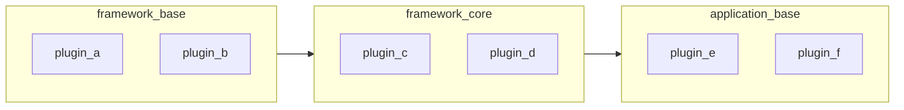

# 架构介绍 Introduction

<!--  -->

[![流程图](https://mermaid.ink/img/pako:eNqdVkFr1EAU_ishXhR2XQpaaLy0tbYUtBY8KBoJk2SSppvMZDNJt6UUVKxgERTpQXpQi4KeBD0UbUX_THdX_4VvMkk22d3sZt3TvDffN-9972Xezq5sUBPLiqwS3aVGs67jEKlEgp9B3cgjTJqZVYnwIN9_oMrn3486B8ed08Pe4WdVfqjMiM2YrugaUmauCk9C0QRtMWIOwYxJC77vOgYKHUqALqCYmGkQK8BZkEbv46_Oi9Pe2afu89-9o6fd42fdtycZKw0JlEJQK9CwbW8yDRsbFA6bB6vB1xkzQSESalYbEMs0WCDhSkAjX1oPnC0UYmn57iBc3wmxiYiBM9Ji4hlDIg7N4Gurt0tjFEqgxyU46Hx9UipZL0hOm3UlPSM5hxdCa2M9qcIma4BRSDF3Ygrub_If85GBi64EpxmUWFDmjTDkHZ4XZoObhRAjKDo1d3IUbhYouWoMKGGQLg4LeoRrkqoEVVGbQKfptlku2TYrU5eQxMfXxBi-fdfZwv1kua8e-yaptSM32k47FxtjO5fBJ-rLkNN0b4j0H_0TZwS-0VcExgRFHFFNESDFBU1DxMZQiCJBrMIAGQ6x-3kljkmK-NXWLQsGnMO5YDbArINZqipHmagrh52mV3kaXzcpsbN-8Ry5o16lY5zttVKa16obEQuph4Ox8rxWJWVeK0a3IhzhNERsjBQE6KQETWQ1Ua4GsT2sZGikDkzUi3_ffPuz_wrsSyOGa5XZyq85HHrDti9vspKKcEyliWO4_BO6fnN15GjxaPyn2Nn_2fny4_zsQ-_94_G9iz9sbRs4K7C4V5adQFW8YOUpiv3pk0RBGDGe5AJflGYZwyqkKY4bk2cCmD7R-EohxlnwFy6twZMJei4tgktaDpCH2zRolqWfkqvddwCOUZBBKmkYEMMnR-fdae_4Uffl6_OzkxGPN7_w4bsUmTiQeMB1N7IdIvmOj114xkFRUtX5KIaLGFvCluQLuOW4rnLBsjDW9Wu57YydIOZm59LtJGitH7SWBq31aeJ8lcg1GcaRhxwTnrC7PBdVDjewB0NEgaWJLRS58DJQyR5AURTSOzvEkJUwiHBNjnwTHmFLDrLhYFmxkMvA6yNyn9K-jU0npMEt8UyOX8t7_wA6C6xu?type=svg)](https://mermaid.live/edit#pako:eNqdVkFr1EAU_ishXhR2XQpaaLy0tbYUtBY8KBoJk2SSppvMZDNJt6UUVKxgERTpQXpQi4KeBD0UbUX_THdX_4VvMkk22d3sZt3TvDffN-9972Xezq5sUBPLiqwS3aVGs67jEKlEgp9B3cgjTJqZVYnwIN9_oMrn3486B8ed08Pe4WdVfqjMiM2YrugaUmauCk9C0QRtMWIOwYxJC77vOgYKHUqALqCYmGkQK8BZkEbv46_Oi9Pe2afu89-9o6fd42fdtycZKw0JlEJQK9CwbW8yDRsbFA6bB6vB1xkzQSESalYbEMs0WCDhSkAjX1oPnC0UYmn57iBc3wmxiYiBM9Ji4hlDIg7N4Gurt0tjFEqgxyU46Hx9UipZL0hOm3UlPSM5hxdCa2M9qcIma4BRSDF3Ygrub_If85GBi64EpxmUWFDmjTDkHZ4XZoObhRAjKDo1d3IUbhYouWoMKGGQLg4LeoRrkqoEVVGbQKfptlku2TYrU5eQxMfXxBi-fdfZwv1kua8e-yaptSM32k47FxtjO5fBJ-rLkNN0b4j0H_0TZwS-0VcExgRFHFFNESDFBU1DxMZQiCJBrMIAGQ6x-3kljkmK-NXWLQsGnMO5YDbArINZqipHmagrh52mV3kaXzcpsbN-8Ry5o16lY5zttVKa16obEQuph4Ox8rxWJWVeK0a3IhzhNERsjBQE6KQETWQ1Ua4GsT2sZGikDkzUi3_ffPuz_wrsSyOGa5XZyq85HHrDti9vspKKcEyliWO4_BO6fnN15GjxaPyn2Nn_2fny4_zsQ-_94_G9iz9sbRs4K7C4V5adQFW8YOUpiv3pk0RBGDGe5AJflGYZwyqkKY4bk2cCmD7R-EohxlnwFy6twZMJei4tgktaDpCH2zRolqWfkqvddwCOUZBBKmkYEMMnR-fdae_4Uffl6_OzkxGPN7_w4bsUmTiQeMB1N7IdIvmOj114xkFRUtX5KIaLGFvCluQLuOW4rnLBsjDW9Wu57YydIOZm59LtJGitH7SWBq31aeJ8lcg1GcaRhxwTnrC7PBdVDjewB0NEgaWJLRS58DJQyR5AURTSOzvEkJUwiHBNjnwTHmFLDrLhYFmxkMvA6yNyn9K-jU0npMEt8UyOX8t7_wA6C6xu)

（上图仅用于表达相关组件的层级关系，与各商业公司的基础设施和具体实现无关）

## 设计理念

在已有的大规模 Node.js 应用实践中会发现，跨团队/部门间往往会存在一些相似的基建 SDK 与通用逻辑集合，仅依靠一个个离散的 npm 包级别的封装难以进行有效的应用治理。

因此会天然存在需求：需要有对应的设计对这些通用逻辑集合进行存放和统一的管理。这样，一个不具备框架级别复用能力的框架本身就无法在大规模的 Node.js 应用中铺开。

既能进行统一的通用逻辑治理，又能满足各个业务团队本地化定制的需求，面向框架的框架设计应运而生。

## 架构分层

参照 OOP 语言的继承，将框架设计立体化，垂直的继承链路可以很方便处理不同的业务团队对通用逻辑集合的存放和统一的管理需求。

由于通用逻辑集合本身往往是一组封装好的原子 npm 模块，因此框架的继承又会有别于 OOP 语言的继承：可以将多个业务上平级的框架各自管理的通用逻辑集合进行合并。

最后需要在垂直的框架继承链路之外增加水平的框架切面插槽，满足进一步的扩展需求。

因此根据职能边界，进行以下的结构分层

- `application`：应用，具备独立部署且提供完整能力的最小单位
- `plugin`：插件，对中间件缺失的应用生命周期通用能力的补充，也可以认为是对应用通用能力的扩展
- `framework`：框架，提供业务逻辑无关的一组基础能力透出，可以认为是一组插件的集合

其中`application`、`plugin` 和 `framework` 之间的关系如下：

<!--  -->

`framework` 是一组插件能力的集合，仅提供如下能力：

- 一组插件的管理
- 通用配置

框架也可以通过继承的方式进行层层递进式扩展，另外需要通过切面的方式支持在 application 对任意垂直继承链路中的平级框架进行替换：

<!-- -->

垂直继承 + 水平切面插槽打造的立体化框架设计，即可从容面对千变万化的 Node.js 研发场景。
