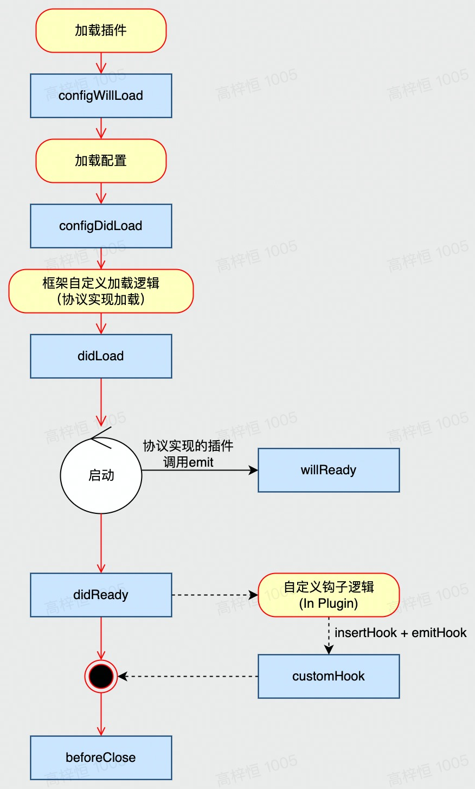

# 插件 Plugin

import { Callout } from 'nextra/components';

## 插件能做什么

<Callout type='info' emoji='ℹ️'>
  Framework(Plugin) = Core + Custom Loader + Plugins
</Callout>

在 `Application` 和 `Framework(Plugin)` 之外增加一层插件（`Plugin`）的抽象，主要是解决以下问题：

- 以可复用的方式对 `application` 进行通用能力扩展
- 完整介入 `application` 生命周期钩子
- 对请求模型中的 `pipeline` 引入的中间件顺序自定义
- 实现通用业务逻辑的复用或者对巨石型应用以逻辑插件粒度的拆分

## 目录结构

从插件定义中可以看到，它的能力决定了插件本质上就是 _Mini_ `Application`，因此其目录组织结构和 `Application` 保持一致。

## 元信息

`Plugin` 同样会以 npm 模块的形式进行发布，但是与此同时它又会有别于通用的标准 npm 模块，反映为：

- 必须存在 `main` 或者 `exports` 入口，即直接 `require` 需要入口
- 入口文件同级存在 `meta.json` 文件用于描述插件元信息

下面是一个最简化的 `meta.json` 内容：

```json
{
  "name": "plugin-example"
}
```

- `name`: 在 Artus Core 中标记插件的真正名称，在插件列表中具有唯一性

## 依赖管理

`Plugin` 的依赖管理会分为两个部分：

- 依赖的标准 npm 模块
- 依赖的其余 `Plugin`

对于前者，这部分依赖会按照 npm 的通用依赖规则放到 `package.json` 的 `dependencies` / `devDependencies` 中；

对于后者，当前 `Plugin` 依赖的其余 `Plugin` 的时候，需要通过如下方式申明，以便扫描机制对其进行额外处理：

```json
{
  "name": "plugin-example",
  "dependencies": [
    {
      "name": "plugin-a"
    },
    {
      "name": "plugin-b",
      "optional": true
    }
  ]
}
```

- `dependencies`：数组，当前 `Plugin` 的前置依赖项列表
- `dependencies[i].name`: 字符串，前置依赖 `Plugin` 项目名称
- `dependencies[i].optional`: 布尔值，前置依赖 `Plugin` 项目是否可选，默认为 false

`Plugin` 之间的依赖顺序会于 Artus Core 中在启动前根据 `artusjsPlugin` 配置的 `dependencies` 进行计算，出现 `Plugin` 间的循环依赖需要抛出对应的错误。

## 开启关闭

插件虽然目录和 `Application` 保持一致，但是其自身不应当被允许直接部署或者执行，因此 `Plugin` 的开启和关闭管理应当置于 `Application` / `Framework` 中进行。

插件的启停管理配置位于 `${application/framework}/config/plugin[.${env}].[js|ts]` 中：

```ts
export default {
  // inline plugin
  foo: {
    enable: true,
    path: path.join(__dirname, '../plugins/foo'),
  },

  // npm plugin
  bar: {
    enable: true,
    package: '@artusjs/plugin-bar',
  },
};
```

- 配置名称应当和对应 `Plugin` 中 `meta.json` 里的 `name` 一致，Artus Core 需要对此处进行校验，不一致则抛错
- `enable`: Boolean，是否启用此插件
- `path`: 渐进式开发中的内联插件，此配置为内联插件的具体绝对路径，配置此项后 `package` 不再生效
- `package`: 独立 npm 包形式引入的插件对应的 npm 包名

## 支持多级别的 API 可见性

在 `meta.json` 中添加 `type` 标识插件类型：

```json
{
  "name": "plugin-example",
  "dependencies": [
    {
      "name": "plugin-a"
    },
    {
      "name": "plugin-b",
      "optional": true
    }
  ],
  "type": "simple"
}
```

根据插件职能边界，提供两种插件类型：

- simple: 对应基础工具、中间件的简单封装，例如：`@artusjs/redis`
- module: 对应完整的 Mini Application，提供业务逻辑的复用或者巨型应用模块拆分

插件使用提供的不同级别 API 注入方法：

- private: 仅允许本插件内部使用
- internal: 仅允许插件之间调用
- public: 面向开发者使用

以下是使用样例：

```ts
// src/app/service/any.ts
import { Inject, Injectable, ScopeEnum } from '@artusjs/core';

@Injectable({
    scope: ScopeEnum.Execution,
    namespace: 'service'
});
export default class AnyService {
  async someMethod() {

  }
}
```

```js
// app.js

const { PluginBase } = require('@artusjs/core');
const AnyService = require('src/app/service/any');

module.exports = class AnyPlugin extends PluginBase {
  constructor(app) {
    this.app = app;
  }

  async willReady() {
    this.registerApi(AnyService, {
      visibility: 'private',
      scope: 'execution',
      namespace: 'service',
    });
  }
};
```

// TODO: 增加 plugin type 为 module 时（即插件为完整的业务复用逻辑模块）针对模块自身的元信息描述

## 生命周期

Core 中应有一套生命周期钩子管理机制

- Core 通过内置的生命周期列表维护一个 hookList
- Hook 应当支持异步行为，允许返回 Promise 或同步返回量
- 生命周期需要可以提供一个工具方法来进行分析
  - 提供 Meta + Timestamp
  - 日志需要友好
  - 方便追溯
- 提供 insertHook 方法，用于框架基础插件中增加自定义的生命周期
- 提供 registerHook 方法，用于增加对应的生命周期处理函数
  - 注册动作应当有序，Core 将依照注册顺序调用之
  - 自定义钩子需要在 insert 后再 register，否则直接跑错，避免预期外效果，
- 提供 emitHook 方法，用于在特定时间点触发生命周期处理
  - 内置的生命周期将由 Core 负责触发
  - 自定义的生命周期需由对应调用 insertHook 的插件在内置钩子的处理器中予以 emit

其中，Artus 规范内置的生命周期事件包括：

- **configWillLoad** 配置文件即将加载，这是最后动态修改配置的时机
- **configDidLoad** 配置文件加载完成
- **didLoad** 文件加载完成
- **willReady** 插件启动完毕
- **didReady** 应用启动完成
- **beforeClose** 应用即将关闭

TODO: 补充 Plugin 的加载和卸载对应的生命周期钩子

## 启动流程



注：上图中自定义钩子逻辑仅为示意，可在任意 hook 位置启动这一机制
