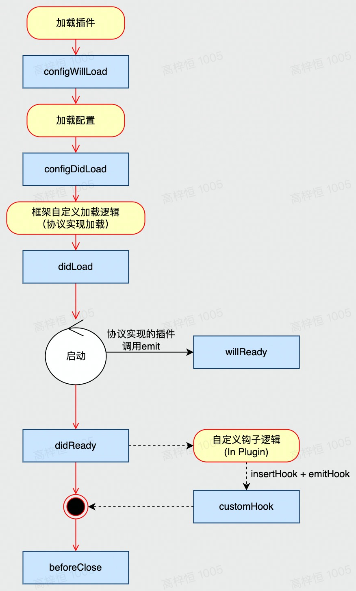

# 框架 Framework

> 框架概念将在 2.x 中废弃，由 plugin 继承，替代框架概念。

## 框架和 Core 的关系

> Framework = Core + Custom Loader + Plugins

## 框架包含哪些核心类

- Application：对 Core 的继承和进一步实现

```ts
class Application extends Core {
  // 指定 Loader
  get [APP_LOADER](): Loader {
    return CustomLoader;
  }
}
```

- Loader：自定义 Loader 实现

TODO: 需要与 Loader 部分对齐 API

```ts
class CustomLoader {
  /**
   * 加载插件配置 和 应用配置
   */
  loadConfig(): void {}

  /**
   * 执行加载
   */
  load(): void {}
}
```

## 生命周期

Core 中应有一套生命周期钩子管理机制

- Core 通过内置的生命周期列表维护一个 hookList
- Hook 应当支持异步行为，允许返回 Promise 或同步返回量
- 生命周期需要可以提供一个工具方法来进行分析
  - 提供 Meta + Timestamp
  - 日志需要友好
  - 方便追溯
- 提供 insertHook 方法，用于框架基础插件中增加自定义的生命周期
- 提供 registerHook 方法，用于增加对应的生命周期处理函数
  - 注册动作应当有序，Core 将依照注册顺序调用之
  - 自定义钩子需要在 insert 后再 register，否则直接跑错，避免预期外效果，
- 提供 emitHook 方法，用于在特定时间点触发生命周期处理
  - 内置的生命周期将由 Core 负责触发
  - 自定义的生命周期需由对应调用 insertHook 的插件在内置钩子的处理器中予以 emit

其中，Artus 规范内置的生命周期事件包括：

- **configWillLoad** 配置文件即将加载，这是最后动态修改配置的时机
- **configDidLoad** 配置文件加载完成
- **didLoad** 文件加载完成
- **willReady** 插件启动完毕
- **didReady** 应用启动完成
- **beforeClose** 应用即将关闭

TODO: 补充 Plugin 的加载和卸载对应的生命周期钩子

## 启动流程



注：上图中自定义钩子逻辑仅为示意，可在任意 hook 位置启动这一机制
