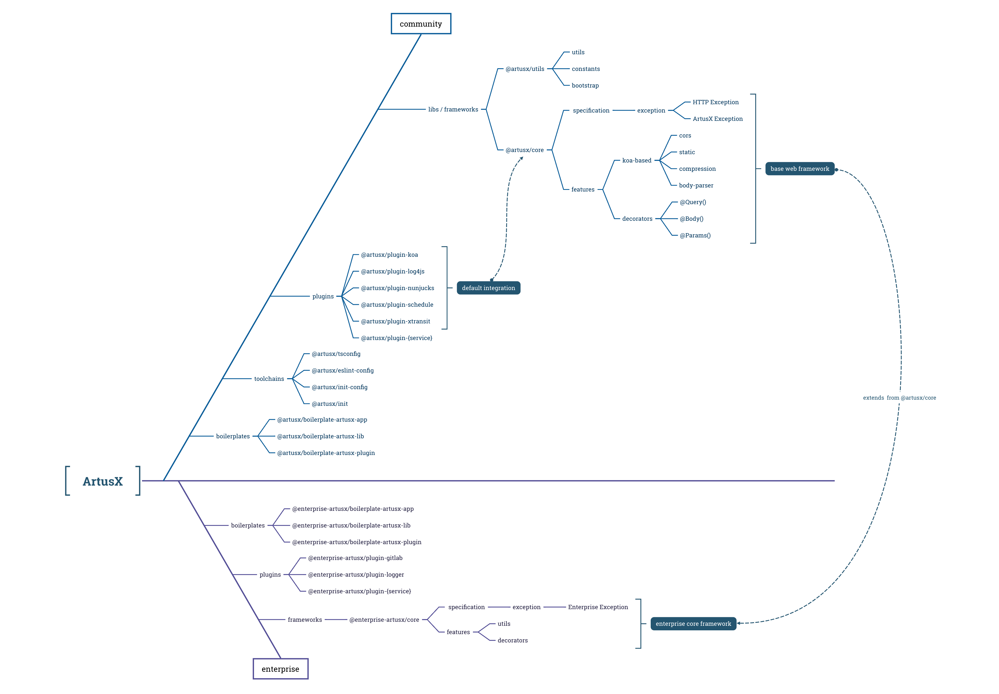

---
packages:
  - name: '@artusx/core'
    badge: https://img.shields.io/npm/v/@artusx/core.svg?style=flat-square
    url: https://npmjs.org/package/@artusx/core
  - name: '@artusx/utils'
    badge: https://img.shields.io/npm/v/@artusx/utils.svg?style=flat-square
    url: https://npmjs.org/package/@artusx/utils)
  - name: '@artusx/init'
    badge: https://img.shields.io/npm/v/@artusx/init.svg?style=flat-square
    url: https://npmjs.org/package/@artusx/init
  - name: '@artusx/init-config'
    badge: https://img.shields.io/npm/v/@artusx/init-config.svg?style=flat-square
    url: https://npmjs.org/package/@artusx/init-config
  - name: '@artusx/tsconfig'
    badge: https://img.shields.io/npm/v/@artusx/tsconfig.svg?style=flat-square
    url: https://npmjs.org/package/@artusx/tsconfig
  - name: '@artusx/eslint-config'
    badge: https://img.shields.io/npm/v/@artusx/eslint-config.svg?style=flat-square
    url: https://npmjs.org/package/@artusx/eslint-config
  - name: '@artusx/rush-utils'
    badge: https://img.shields.io/npm/v/@artusx/rush-utils.svg?style=flat-square
    url: https://npmjs.org/package/@artusx/rush-utils
  - name: '@artusx/plugin-koa'
    badge: https://img.shields.io/npm/v/@artusx/plugin-koa.svg?style=flat-square
    url: https://npmjs.org/package/@artusx/plugin-koa
  - name: '@artusx/plugin-nest'
    badge: https://img.shields.io/npm/v/@artusx/plugin-nest.svg?style=flat-square
    url: https://npmjs.org/package/@artusx/plugin-nest
  - name: '@artusx/plugin-express'
    badge: https://img.shields.io/npm/v/@artusx/plugin-express.svg?style=flat-square
    url: https://npmjs.org/package/@artusx/plugin-express
  - name: '@artusx/plugin-redis'
    badge: https://img.shields.io/npm/v/@artusx/plugin-redis.svg?style=flat-square
    url: https://npmjs.org/package/@artusx/plugin-redis
  - name: '@artusx/plugin-log4js'
    badge: https://img.shields.io/npm/v/@artusx/plugin-log4js.svg?style=flat-square
    url: https://npmjs.org/package/@artusx/plugin-log4js
  - name: '@artusx/plugin-ejs'
    badge: https://img.shields.io/npm/v/@artusx/plugin-ejs.svg?style=flat-square
    url: https://npmjs.org/package/@artusx/plugin-ejs
  - name: '@artusx/plugin-nunjucks'
    badge: https://img.shields.io/npm/v/@artusx/plugin-nunjucks.svg?style=flat-square
    url: https://npmjs.org/package/@artusx/plugin-nunjucks
  - name: '@artusx/plugin-schedule'
    badge: https://img.shields.io/npm/v/@artusx/plugin-schedule.svg?style=flat-square
    url: https://npmjs.org/package/@artusx/plugin-schedule
  - name: '@artusx/plugin-grpc'
    badge: https://img.shields.io/npm/v/@artusx/plugin-grpc.svg?style=flat-square
    url: https://npmjs.org/package/@artusx/plugin-grpc
  - name: '@artusx/plugin-pptr'
    badge: https://img.shields.io/npm/v/@artusx/plugin-pptr.svg?style=flat-square
    url: https://npmjs.org/package/@artusx/plugin-pptr
  - name: '@artusx/plugin-proxy'
    badge: https://img.shields.io/npm/v/@artusx/plugin-proxy.svg?style=flat-square
    url: https://npmjs.org/package/@artusx/plugin-proxy
  - name: '@artusx/plugin-openai'
    badge: https://img.shields.io/npm/v/@artusx/plugin-openai.svg?style=flat-square
    url: https://npmjs.org/package/@artusx/plugin-openai
  - name: '@artusx/plugin-telegram'
    badge: https://img.shields.io/npm/v/@artusx/plugin-telegram.svg?style=flat-square
    url: https://npmjs.org/package/@artusx/plugin-telegram
  - name: '@artusx/plugin-xtransit'
    badge: https://img.shields.io/npm/v/@artusx/plugin-xtransit.svg?style=flat-square
    url: https://npmjs.org/package/@artusx/plugin-xtransit
  - name: '@artusx/plugin-sequelize'
    badge: https://img.shields.io/npm/v/@artusx/plugin-sequelize.svg?style=flat-square
    url: https://npmjs.org/package/@artusx/plugin-sequelize
  - name: '@artusx/boilerplate-artusx-app'
    badge: https://img.shields.io/npm/v/@artusx/boilerplate-artusx-app?style=flat-square
    url: https://npmjs.org/package/@artusx/boilerplate-artusx-app
  - name: '@artusx/boilerplate-artusx-lib'
    badge: https://img.shields.io/npm/v/@artusx/boilerplate-artusx-lib?style=flat-square
    url: https://npmjs.org/package/@artusx/boilerplate-artusx-lib
  - name: '@artusx/boilerplate-artusx-plugin'
    badge: https://img.shields.io/npm/v/@artusx/boilerplate-artusx-plugin?style=flat-square
    url: https://npmjs.org/package/@artusx/boilerplate-artusx-plugin
---

# ArtusX

import Table from '../../../components/table';

[](https://github.com/artusjs/artusx/actions/workflows/ci.yml)

ArtusX 是 Artus.js 生态中的常用插件以及聚合插件（原 framework 概念），提供了应用开发使用的 web 插件如 koa 以及日志插件 log4js；同时也提供一些聚合插件如 core，其默认集成 koa 与 log4js 插件，便于研发同学快速完成项目的配置。



## 项目

{/* > <https://github.com/artusjs/artusx> */}

插件通常用于实现某种能力，其功能相对原子化；但业务开发中，通常需要一组插件，逐个接入配置较为繁琐，我们可以将一组插件进行聚合，并以插件的方式发布，研发仅启用该插件即可；artusx 按照如下结构存放代码：

- apps：示例项目（不发布 npm 包）
- libs：聚合插件（集成多个 artus plugin）
- plugins：artus 插件

```bash
packages
├── apps
│   ├── artusx-api
│   ├── artusx-express
│   └── artusx-koa
├── libs
│   ├── core
│   └── utils
└── plugins
    ├── koa
    ├── grpc
    ├── express
    ├── log4js
    ├── schedule
    ├── ejs
    ├── nunjucks
    ├── xtransit
    ├── redis
    ├── sequelize
    ├── pptr
    ├── openai
    ├── proxy
    └── telegram
```

## 模块

<Table />
